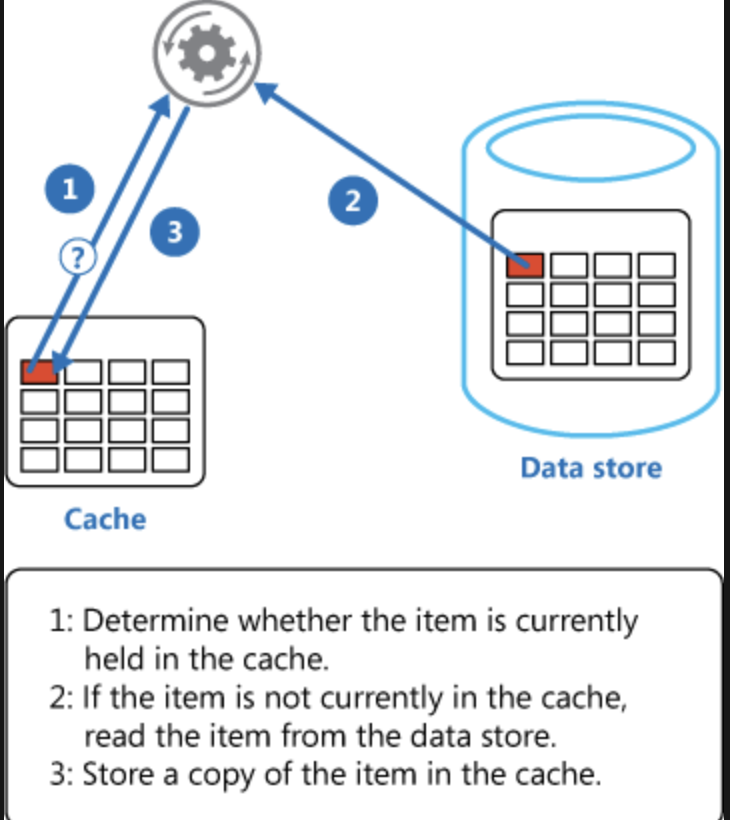

# Cache-aside implementation

KoreaInvestment does not allow to call API to issue(or get the previous one) a token within 1 minute.

This cache-aside implementation prevents *Frequent API calls*. Instead, cache the token, and reuse the cached token.

Basic implementation: (image source is [azure website](https://learn.microsoft.com/en-us/azure/architecture/patterns/cache-aside))

## Known issues

The token doesn't have expiry date. Instead, a token in cache becomes invalidated in 5 minutes.